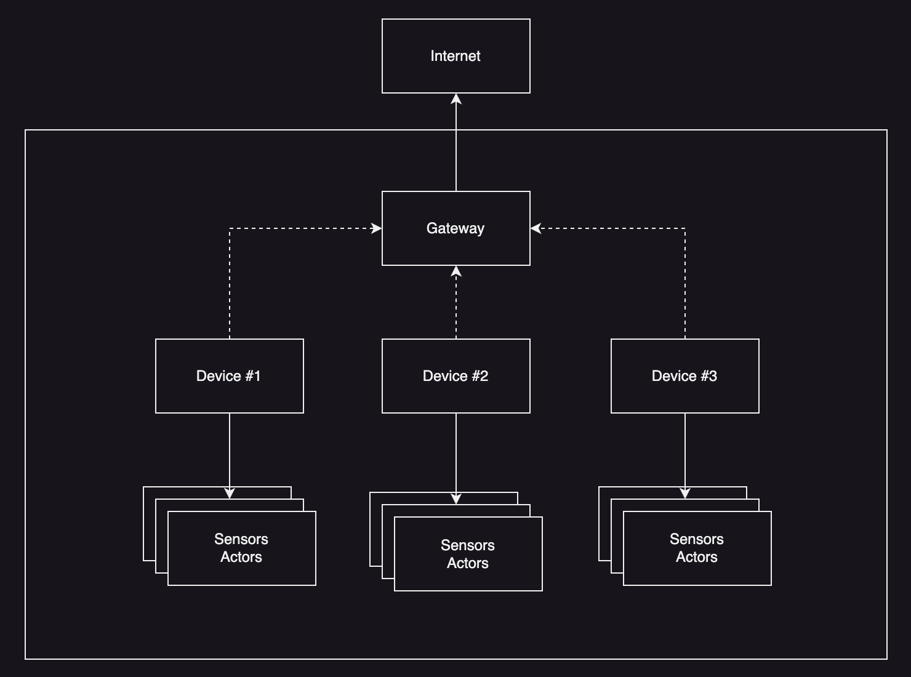

# Edge Device Monitoring with OpenTelemetry

You have set up your production line. All machines ready for action! You've installed your sensors, actors and mini-computers. You've coded your edge apps to gather & process the data you're collecting from your devices. You automated everything, built cool dashboards to see what da hell's happening in your production line.

Though, how do you make sure those apps work the way you expect them to? How do you know whether your mini-computer where your apps run are healthy?

## Prerequisites

1. bash
2. Terraform
3. Azure account
4. New Relic account
5. Go SDK (optional)

## Arcitecture

Obviously, we're too lazy to demonstrate everything with real devices or mini-computers in an actual production line... So, we'll replicate a similar environment in the cloud! Bare with me, it gets better.



Within your production line, you wouldn't want to have your every single device to be connected to the internet. Not only it's an unnecessary cost, but it increases the surface attack. Instead, you can embed your devices into a local network and only allow a particular subnet to have an internet connection.

If we were to replicate that, it would be

- multiple VMs (your mini-computers where your apps running)
- a central VM (gateway which collects the data and flush to any backend)

Your apps would keep reading sensor data, process them and activate the relevant actors. They are already connected (which we'll be mocking).

However, we're blind when it comes to measure whether they are reading, processing and acting properly... Right at this point, comes the observability!

## What is observability?

Observability stands for monitoring & comprehending your business according to the relevant dependencies. We can extend the definition far up till how your business makes money. For the sake of simplicity, we'll keep it around the technical IT environment in this tutorial.

First, we need to gather the application and infrastructure level telemetry data. Telemetry data can be analyzed in 3 major categories:

- metrics
- logs
- traces

Metrics are aggregated values of your measurements on a particular field.

Logs are most traditional checkpointwise events which you can fire out from your code when certain steps are executed.

Traces are time-intervaled spans with which you can keep track of individual steps of a logical execution.

All that being said, collection and generation of these telemetry data require proper standardization. This is the point where [OpenTelemetry](https://opentelemetry.io/docs/what-is-opentelemetry/) comes in to play! Let's see how the community describes itself:

_OpenTelemetry is an Observability framework and toolkit designed to create and manage telemetry data such as traces, metrics, and logs. Crucially, OpenTelemetry is vendor- and tool-agnostic, meaning that it can be used with a broad variety of Observability backends, including open source tools like Jaeger and Prometheus, as well as commercial offerings._

With the tools of OpenTelemetry we will be collecting, processing and sending the relevant telemetry data with which we will monitor our IT setup. But where to we send that data?

Enters [New Relic](https://newrelic.com/about)! It is an extremely scalable SaaS data platform specifically tailored for IT observability.

## Instrumentation

Man, I'm too lazy for this shit... Go ahead and check the [code](apps/device).

## Deploy!

So now,

- we deployed a VNET and subnets for edge & gateway VMs
- we implemented OpenTelemetry instrumentation into our device application
- we deployed OpenTelemetry collectors onto all VMs
- we configured them the edge collectors to flush their data to the gateway VM and gateway to New Relic.

Let's fire it up:

```shell
cd ./infra/azure/scripts
bash 01_deploy_setup.sh --project mydopeiotstuff --instance 001
```

This will deploy the VMs into their relevant subnets, automatically install the necessary packages, configure and run the OpenTelemety collectors.

Now, let's deploy our applications. We'll be doing it manually because we'll be generating some intentional errors 😈

Go to Azure portal to get the public IP addresses of your edge VMs and SSH into them one by one in separate terminals:

```shell
ssh adminuser@<IP_ADDRESS_OF_DEVICE_X>
```

Clone the repo:

```shell
git clone https://github.com/utr1903/edge-device-monitoring-with-opentelemetry.git
```

Run the application manually (replace `x` with device identifier -> `device-0`, `device-1`, `device-2`...):

```shell
cd ./edge-device-monitoring-with-opentelemetry/apps/device
OTEL_SERVICE_NAME=device OTEL_EXPORTER_OTLP_ENDPOINT=http://localhost:4317 OTEL_EXPORTER_OTLP_LOGS_ENDPOINT=http://localhost:4318/v1/logs OTEL_RESOURCE_ATTRIBUTES=service.name=device,service.instance.id=device-x INCREASE_SENSOR_READ="false" FAIL_ACTUATOR_ACTIVATE="false" go run cmd/main.go
```

Now, go to your New Relic account and check out the incoming data!

## Monitoring

New Relic provides you out-of-the-box OpenTelemetry experience! By default you will be seeing your devices (edge and gateway) being monitored as an `Host` entity. As well as that, you will see your application appearing as an `Application` entity.

If you check them out, you will see that New Relic automatically creates you the golden signals per entity according to their purpose!

BUT! What if we would like to our entire stack in one place so that we instantly figure out what's odd? New Relic has a Terraform provider for itself with which you can IaaC your New Relic resources such as dashboards!

Let's deploy the one in the repo!

```shell
cd ./edge-device-monitoring-with-opentelemetry/infra/azure/scripts
bash 01_deploy_monitoring.sh
```

The dashboard will going to have 2 pages:

**Hosts**


Here, we have the relevant golden metrics of all of the hosts in one picture!

**Apps**


Here, as you can see, we are not only monitoring our Go runtime metrics but also our technical workflow in our devices related to our production line. We keep track of:

- execution time of each step (reading sensor data, processing the sensor data, activating the actors)
- errors and their relevant logs

### Generate some disturbance 😈

Let's open up another terminal, SSH into the first device VM `edge-0` and run the following command to cause some CPU consumption:

```shell
stress-ng --cpu 4 --timeout 180s
```

Within the Host page of the dashboard, you'll see that the `edge-0` will have a CPU spike. Within the process tabs you'll see the cause (`stress-ng` obviously).

Let's switch to the next device VM `edge-1`. Let's stop the code execution and rerun it as follows:

```shell
OTEL_SERVICE_NAME=device OTEL_EXPORTER_OTLP_ENDPOINT=http://localhost:4317 OTEL_EXPORTER_OTLP_LOGS_ENDPOINT=http://localhost:4318/v1/logs OTEL_RESOURCE_ATTRIBUTES=service.name=device,service.instance.id=device-1 INCREASE_SENSOR_READ="true" FAIL_ACTUATOR_ACTIVATE="false" go run cmd/main.go
```

Within the Apps page of the dashboard, you'll see that there will be a spike on the _Average duration of sensor reading (ms)_ widget regarding the `device-1` instance of the app (which indicates that the problem is on the `edge-1` device).

lastly, let's switch to the last device VM `edge-2`. Let's stop the code execution and rerun it as follows:

```shell
OTEL_SERVICE_NAME=device OTEL_EXPORTER_OTLP_ENDPOINT=http://localhost:4317 OTEL_EXPORTER_OTLP_LOGS_ENDPOINT=http://localhost:4318/v1/logs OTEL_RESOURCE_ATTRIBUTES=service.name=device,service.instance.id=device-2 INCREASE_SENSOR_READ="false" FAIL_ACTUATOR_ACTIVATE="true" go run cmd/main.go
```

Within the Apps page of the dashboard, you'll see that there will be a spike on the _Number of errors (-)_ widget regarding the `device-2` instance of the app (which indicates that the problem is on the `edge-2` device).

But what is the error? Filter the dashboard for `edge-2` device and check out the next widget with the logs. You'll see the following log:

```
Actuator is seems to be in failed state and got into sleep mode. Rebooting required!
```
